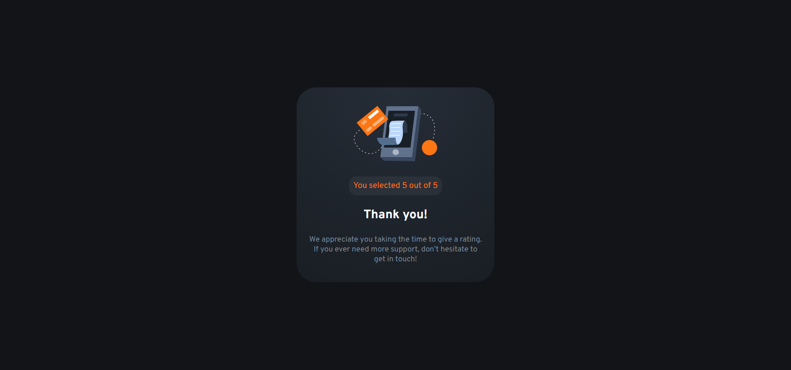
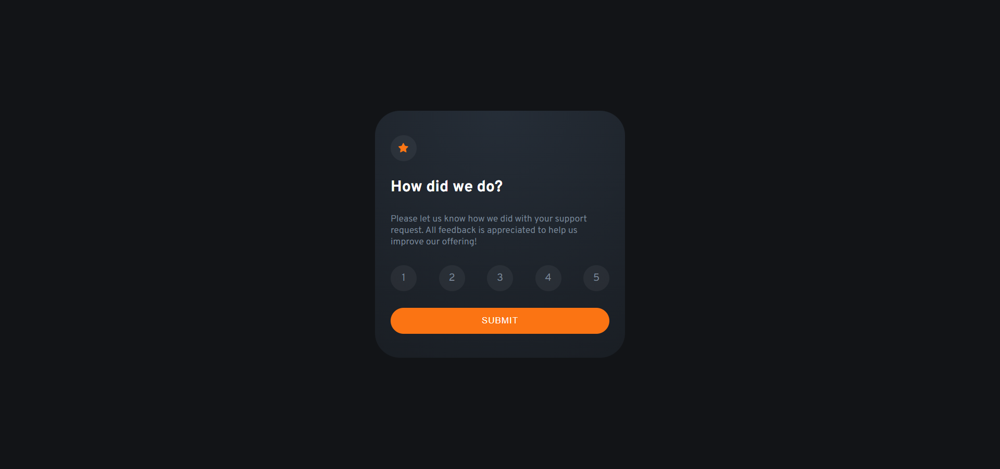
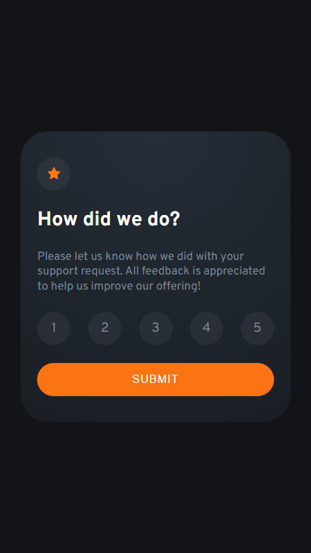
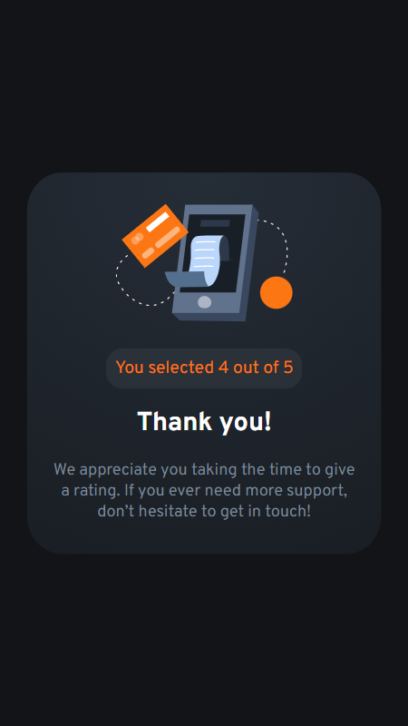

# Frontend Mentor - Interactive rating component solution

This is a solution to the [Interactive rating component challenge on Frontend Mentor](https://www.frontendmentor.io/challenges/interactive-rating-component-koxpeBUmI). Frontend Mentor challenges help you improve your coding skills by building realistic projects.

## Table of contents

- [Overview](#overview)
  - [The challenge](#the-challenge)
  - [Screenshot](#screenshot)
  - [Links](#links)
- [My process](#my-process)
  - [Built with](#built-with)
  - [What I learned](#what-i-learned)
  - [Continued development](#continued-development)
  - [Useful resources](#useful-resources)
- [Author](#author)
- [Acknowledgments](#acknowledgments)

## Overview

### The challenge

Users should be able to:

- View the optimal layout for the app depending on their device's screen size
- See hover states for all interactive elements on the page
- Select and submit a number rating
- See the "Thank you" card state after submitting a rating

### Screenshots

### Links

- Solution URL: [https://www.frontendmentor.io/solutions/rating-card-component-made-with-sass-and-vanilla-javascript-QNBVfbRRex]
- Live Site URL: [https://kamilp522.github.io/Rating-card-component]

## My process

### Built with

- Semantic HTML5 markup
- CSS custom properties
- Flexbox
- CSS Grid
- Mobile-first workflow
- [Sass](https://sass-lang.com/) - preprocessor for css

## Author

- Frontend Mentor - [@kamilp522](https://www.frontendmentor.io/profile/kamilp522)

### What I learned

I learned about more recent sass syntax (using @use and @forward instead of @import) and implemented it into my project.

### Continued development

### Useful resources

- [https://www.youtube.com/watch?v=CR-a8upNjJ0&ab_channel=KevinPowell] - Great video by Kevin Powell explaining newer sass syntax.

## Author

- Frontend Mentor - [@kamilp522](https://www.frontendmentor.io/profile/kamilp522)

## Acknowledgments

I'm gonna still practice on the basic projects but still gonna try some more advanced ones soon.
